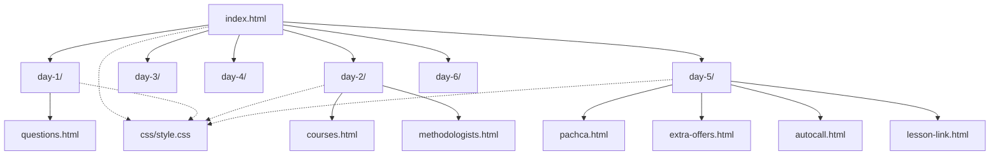

# Структура проекта онбординга Englex

Статический сайт без сборщика: HTML, CSS, JS. Точка входа — `index.html`, материалы разложены по дням в папках `day-1` … `day-6`.

## Навигация

| Уровень | Куда ведёт «Назад» |
|--------|---------------------|
| Главная (`index.html`) | — |
| Индекс дня (`day-N/index.html`) | `../index.html` — «Назад к онбордингу» |
| Внутренняя страница дня | `index.html` в той же папке — «Назад к материалам дня» |

## Дерево папок

```
brand/
├── index.html                 # Выбор дня (6 карточек)
├── обложкаонбординга.png      # Баннер на главной
│
├── css/
│   ├── style.css              # Общие стили (онбординг, дни, гайды, курсы, Пачка)
│   └── questions.css          # Стили страницы вопросов (день 1)
│
├── scripts/
│   ├── generate-days.py       # Заготовки day-3…6 и обновление index (осторожно: перезаписывает)
│   ├── generate-questions.py  # Генерация questions.html из 1.txt / 2.txt
│   └── create-google-form.gs  # Скрипт Google Forms (вспомогательный)
│
├── day-1/                     # Знакомство с брендом
│   ├── index.html
│   ├── questions.html
│   └── image1.jpg
│
├── day-2/                     # Продукты школы
│   ├── index.html
│   ├── courses.html
│   ├── courses.js
│   ├── courses-data.js
│   └── methodologists.html
│
├── day-3/                     # В разработке
│   └── index.html
│
├── day-4/                     # В разработке
│   └── index.html
│
├── day-5/                     # Пачка и ежедневные процессы
│   ├── index.html
│   ├── pachca.html
│   ├── help-topics-data.js
│   ├── help-browser.js
│   ├── extra-offers.html
│   ├── extra-offers-chat.png
│   ├── autocall.html
│   ├── autocall-1.png … autocall-9.png
│   ├── lesson-link.html
│   └── lesson-link-screenshot.png
│
├── day-6/                     # В разработке
│   └── index.html
│
└── [корень]                   # Исходники и медиа (не в git / дубликаты — по необходимости)
    ├── *.txt                  # Тексты для верстки (автозвонок, допПредложения, корпмесспачка…)
    ├── 1.txt, 2.txt           # Вопросы для generate-questions.py
    └── *.png                  # Слайды курсов (day-2 ссылается на ../имя.png)
```

## Материалы по дням

### День 1 — Знакомство с брендом

| № | Страница / ссылка | Файл | Статус |
|---|-------------------|------|--------|
| 1 | Презентация | Google Drive (внешняя) | Готово |
| 2 | 32 вопроса | `questions.html` | Готово |
| 3 | Тест | Google Forms (внешняя) | Готово |

### День 2 — Продукты школы

| № | Страница | Файл | Статус |
|---|----------|------|--------|
| 1 | Обучение от методистов | `methodologists.html` | Готово |
| 2 | 17 курсов | `courses.html` + `courses-data.js` | Готово |
| 3–4 | Тесты (2 формы) | Google Forms (внешние) | Готово |

Изображения курсов: PNG в **корне** репозитория (`англ360.png`, `общийангл.png`, …).

### День 3 — (тема уточняется)

| Файл | Статус |
|------|--------|
| `day-3/index.html` | Заглушка «Скоро» |

### День 4 — (тема уточняется)

| Файл | Статус |
|------|--------|
| `day-4/index.html` | Заглушка «Скоро» |

### День 5 — Пачка и ежедневные процессы

| № | Материал | Файл | Статус |
|---|----------|------|--------|
| 1 | Корпоративный мессенджер Пачка | `pachca.html` | Готово |
| 2 | Чат «Доп.предложения по студентам» | `extra-offers.html` | Готово |
| 3 | Работа с заявками | `applications.html` + `applications-1.png` … `applications-20.png` | Готово |
| 4 | Автозвонок для подтверждения | `autocall.html` | Готово |
| 5 | Ссылка на комнату с преподавателем | `lesson-link.html` | Готово |

Исходные тексты: `корпмесспачка.txt`, `допПредложения.txt`, `автозвонок.txt`, `КакСкопироватьСсылкуНаКомнатуСпреподавателем.txt`.

### День 6 — (тема уточняется)

| Файл | Статус |
|------|--------|
| `day-6/index.html` | Заглушка «Скоро» |

## Типы страниц (CSS-классы на `<main>`)

| Класс | Назначение | Примеры |
|-------|------------|---------|
| `page` | Главная, индекс дня | `index.html`, `day-N/index.html` |
| `content-page--guide` | Пошаговые инструкции | `autocall.html`, `lesson-link.html`, `extra-offers.html` |
| `content-page--links` | Списки внешних ссылок | `pachca.html` |
| `content-page--courses` | Браузер курсов | `courses.html` |

## Схема связей



## Рекомендации при добавлении материала

1. Новая **внутренняя** страница — файл в `day-N/`, ассеты (png) рядом с HTML.
2. Обновить список материалов в `day-N/index.html` (карточка + ссылка «Изучить»).
3. При необходимости — блок стилей в `css/style.css` (префикс `guide-` для инструкций).
4. Не запускать `generate-days.py` на готовых днях 5+ без проверки — скрипт перезаписывает заготовки.
